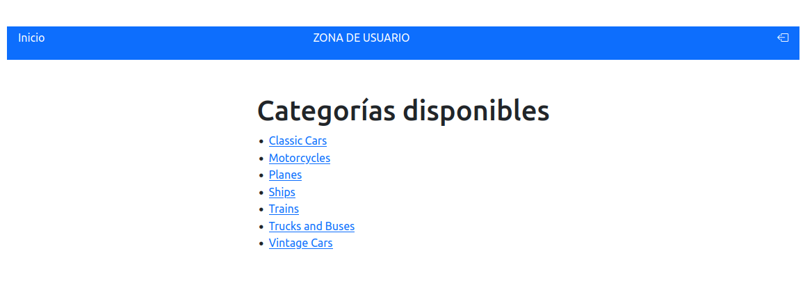
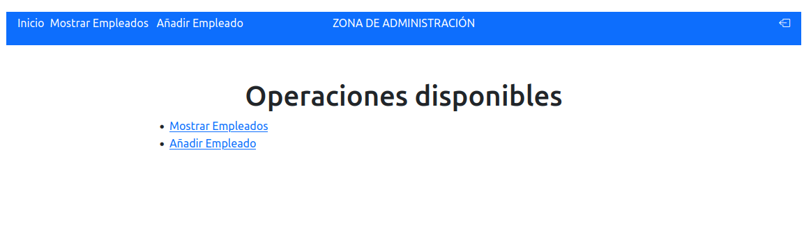
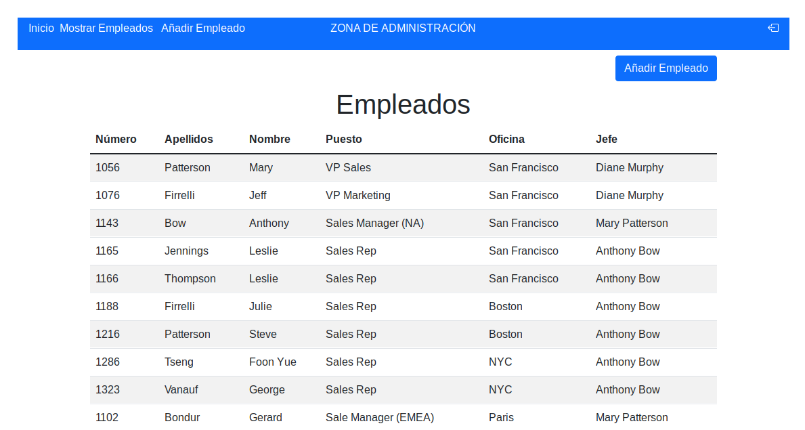
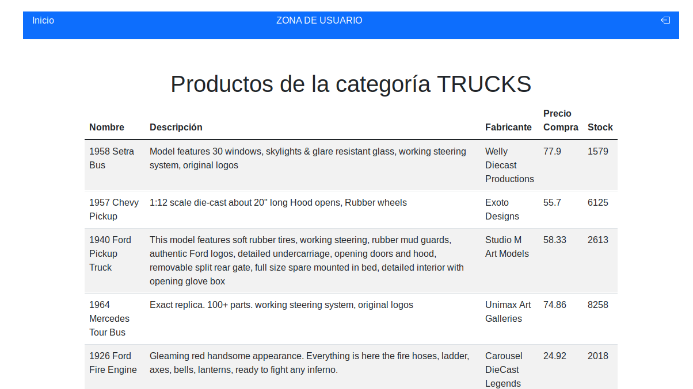

# Ejercicio trimestral - 23_24

Utilizando la base de código realizada a lo largo del trimestre

Modificar el Login (`LoginServlet` en la Ruta /) para que se realice mediante email (como usuario) y el password.

## Pantalla 1: (SERVLET InicioServlet - Ruta /Home)

Esta pantalla será la página de Inicio para todos los usuarios independientemente del valor del campo role.





La primera pantalla corresponde al usuario normal. Mostrará una lista con las categorías (`ProducLines`)
disponibles en la base de datos y cada uno de los elementos de esa lista enlazará con `/MostrarProductos` que mostrará la
información de todos los productos de la categoría seleccionada.

La segunda pantalla corresponde al usuario admin. Mostrará dos enlaces a los Servlet que sean de Admin. (
EmpleadosServlet y AddEmpleadoServlet).

IMPORTANTE: LA ZONA DEL MENÚ SUPERIOR CAMBIA DEPENDIENDO DE LOS USUARIOS

## Pantalla 2 (SERVLET EmpleadosServlet - Ruta /Admin/Empleados)

Esta pantalla solo estará disponible para los usuarios administradores (role "admin").



## Pantalla 3 (SERVLET - AddEmpleadoServlet - Ruta /Admin/AddEmpleado

Esta pantalla solo estará disponible para los usuarios administradores (role "admin").


Consideraciones:

- Los opciones y valores del select de oficina deberán ser tomadas de la base de datos.
- Los opciones y valores del select Jefe deberá recoger los datos de la tabla de empleados de la base de datos.
- En caso de que se intente insertar un empleado cuyo código ya existe se volverá a este formulario mostrando el error
  debajo del campo Número de empleado.
- Si se inserta correctamente se redireccionará a /Admin/Empleados

## Pantalla 4 (SERVLET - MostrarProductosServlet - Ruta /MostrarProductos)

Esta pantalla solo estará disponible para los usuarios normales (role "usuario")



En caso de no haber recibido ningún dato de la categoría se mostrará un MENSAJE "Categoría NO SELECCIONADA" y un enlace
a la página de inicio.

# CONSIDERACIONES GENERALES

- SE DEBE USAR JSTL y EL para las vistas. No se considerarán funcionalidades expresadas de otra forma.
- SE DEBE RESPETAR EL PATRÓN MVC. No se considerarán funcionalidades que no respeten dicha separación.
- Para la recuperación de datos desde la base de datos se deberá usar UN POOL DE CONEXIONES. No se considerarán
  funcionalidades que recuperen los datos de otra forma.
- La comprobación de permisos se debe realizar con **filtros**. En caso de que se realice un intento no permitido se
  expulsará al usuario de sesión y se le REDIRECCIONARÁ a la página de Login.
- Logearé los siguientes eventos: **Inicio de sesión**, **Logout**, **Añadido de empleado**.
- Las páginas de usuario deberán estar disponibles en inglés y español.
- Hay que gestionar correctamente el `Logout` al hacer click en la opción de Salir del menú superior.
- En el menú las opciones serán enlaces a las direcciones correspondientes.

**RECORDAD QUE LOS MODELOS Y LOS DAO PUEDEN NO COINCIDIR EXACTAMENTE CON UNA TABLA DE LA BASE DE DATOS Y PODEMOS
ADAPTARLOS NUESTRAS NECESIDADES (PANTALLAS SOLICITADAS EN NUESTO CASO)**

## <ins>Instrucciones para la Entrega</ins>

Se entregará un proyecto Maven. Dicho proyecto no incluirá ninguno de los archivos generados tras compilar el proyecto.
Todo ello se comprimirá en un archivo llamado:
```
apellidos_nombre_EjercicioTrimestral.zip
```
El proyecto se entregará adicionalmente en el repositorio de GitHub personal dentro de la carpeta ejercicio_trimestral
que se encuentre a su vez dentro de la carpeta correspondiente a la unidad 4.

En caso de no ser entregado en GitHub se considerará como no entregado.